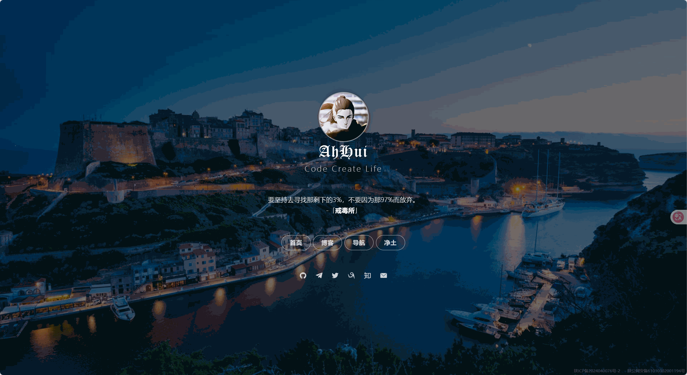
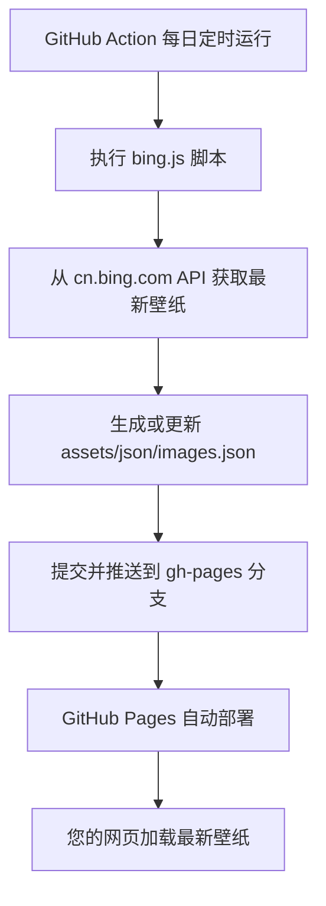

[](https://www.npmjs.com/package/dmego-home-page)
[](http://i.dmego.cn/)
[](/LICENSE)
[](https://saythanks.io/to/dmego)

## 个人主页项目

一个基于 GitHub Pages 的个人主页，每日自动更新 Bing 高清壁纸。



一个简洁、美观的个人主页，灵感源自 [dmego](https://github.com/dmego) 的 [dmego-home-page](https://github.com/dmego/dmego-home-page) 项目。通过 GitHub Actions 实现每日自动更新必应（Bing）高清壁纸。

## ✨ 功能亮点

- 📅 **每日自动更新**：利用 GitHub Actions 定时任务，每天凌晨 1 点（UTC时间）自动从 `cn.bing.com` 抓取最新的高清壁纸（1920x1080）。
- 💬 **每日一言**：集成 [一言](https://hitokoto.cn/) API，为页面增添一句随机的励志或哲理名言。
- ⚡ **轻量高效**：移除了 jQuery 依赖，使用原生 JavaScript，加载更快。
- 🎨 **鼠标特效**：集成鼠标点击爆炸五颜六色特效，增加互动乐趣。

## 📦 文件结构

```markdown
.
├─📁 .github/
│   └─📁 workflows/
│       └─📄 auto-bing.yml             # GitHub Actions 定时任务配置（每天凌晨1点更新Bing壁纸）
├─📁 assets/
│   ├─📁 css/
│   │   ├─📄 footer-style.css         # 网站页脚样式表
│   │   ├─📄 iconfont.css             # 图标字体样式表
│   │   ├─📄 onlinewebfonts.css       # 在线字体样式表
│   │   └─📄 vno.css                  # 主题样式表
│   ├─📁 fonts/
│   │   ├─📄 d571b52b60b5617399ce8eab62bf3eb3.eot     # 字体文件 (EOT格式)
│   │   ├─📄 d571b52b60b5617399ce8eab62bf3eb3.svg     # 字体文件 (SVG格式)
│   │   ├─📄 d571b52b60b5617399ce8eab62bf3eb3.ttf     # 字体文件 (TTF格式)
│   │   ├─📄 d571b52b60b5617399ce8eab62bf3eb3.woff    # 字体文件 (WOFF格式)
│   │   └─📄 d571b52b60b5617399ce8eab62bf3eb3.woff2   # 字体文件 (WOFF2格式，压缩率更高)
│   ├─📁 img/
│   │   ├─📁 action/
│   │   │   ├─📄 action-1.png         # 动作图标 1
│   │   │   ├─📄 action-2.png         # 动作图标 2
│   │   │   ├─📄 action-3.png         # 动作图标 3
│   │   │   ├─📄 action-4.png         # 动作图标 4
│   │   │   └─📄 logo.jpg             # 动作Logo
│   │   ├─📄 home.gif                 # 首页动画GIF
│   │   └─📄 logo.png                 # 主要Logo图片
│   ├─📁 js/
│   │   ├─📄 bing.js                  # 获取每日Bing壁纸URL的Node.js脚本
│   │   ├─📄 djtx.js                  # 鼠标点击爆炸特效脚本
│   │   └─📄 main.js                  # 主要JavaScript脚本（包含getBingImages函数定义）
│   └─📁 json/
│       └─📄 images.json              # 存储每日Bing壁纸URL的JSONP文件
├─📄 404.html                       # 404错误页面
├─📄 .gitignore                     # Git版本控制忽略文件列表
├─📄 ActionNotes.md                 # 关于GitHub Actions的说明文档
├─📄 apple-touch-icon.png           # iOS设备上的网站图标
├─📄 CNAME                          # 自定义域名配置文件
├─📄 favicon.ico                    # 网站favicon图标
├─📄 index.html                     # 网站主页HTML文件
├─📄 LICENSE                        # 软件许可证
├─📄 package.json                   # Node.js项目配置文件
└─📄 README.md                      # 项目说明文档
```

## ⚙️ GitHub Actions 配置说明

- 利用 `Github Action` 提交代码需要一个 `GitHub API` 令牌, 可以在 [Create Tokens](https://github.com/settings/tokens) 这个地址，点击 `Generate new token` 按钮来创建
  - `Expiration` 过期时间设置为 `No expiration`
  - `Select scopes` 勾选 `repo`
  - 点击 `Generate Token` 生成
- 在仓库的 `Settings` ——>`Secrets` 功能栏中，点击 `New repository secrets` 按钮
  -  在 `Name` 框中填写 `GH_TOKEN`
  -  在 `Secrets` 栏中填写第一步生成的 `Token` 值
- 详细配置步骤图可以参考《[GitHub Action 配置详细步骤](./ActionNotes.md)》文档

## ⏱️ 自动化工作流



1. **定时触发**：GitHub Actions 每天在设定时间自动触发。
2. **获取数据**：`bing.js` 脚本调用 Bing API，获取包含最近 8 天壁纸 URL 的 JSON 数据。
3. **生成文件**：脚本将数据转换为 `getBingImages([...])` 格式的 JSONP，并写入 `assets/json/images.json` 文件。
4. **自动部署**：工作流将更新后的 `images.json` 文件提交并推送到 `gh-pages` 分支。
5. **网页加载**：您的 `index.html` 通过 `<script>` 标签加载 `images.json`，执行 `getBingImages` 函数，从而设置最新的背景图片。


## 📝 更新记录

- **2023-08-28**: 将壁纸地址从 `www.bing.com` 换成 `cn.bing.com`，确保在中国大陆也能正常访问。
- **2023-04-12**: 移除 jQuery 依赖，改用原生 JavaScript，提升性能。
- **2023-02-27**: 添加《GitHub Action 配置详细步骤》文档。
- **2022-06-10**: 发布 NPM 包，使用 UNPKG 作为资源文件的 CDN。

## 🤝 致谢与参考

- **设计灵感**: 本项目衍生自 [Vno ](https://github.com/onevcat/vno-jekyll)Jekyll 主题。
- **功能参考**: 页面加载效果借鉴了 [Mno ](https://github.com/mcc108/mno)Ghost 主题。
- **头像样式**: 参考了 [北岛向南的小屋 ](https://javef.github.io/)的头像样式。
- **核心机制**: 借鉴并改进了 [dmego ](https://github.com/dmego)的 `dmego-home-page` 项目。

## 📄 许可证

本项目基于 [MIT 许可证 ](https://chat.qwen.ai/c/LICENSE)开源，欢迎学习和使用。
